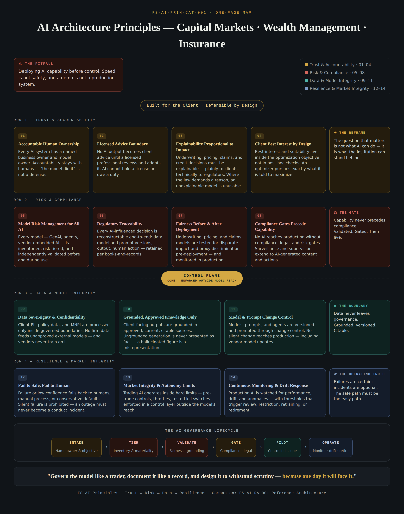

# FS-AI Framework

### AI Architecture Principles & Reference Architecture for Capital Markets, Wealth Management & Insurance

**The financial-services implementation layer for AI governance.**

> *"Govern the model like a trader, document it like a record, and design it to withstand scrutiny — because one day it will face it."*

---

## Why this exists

Standards bodies define **what** to care about (NIST AI RMF, ISO/IEC 42001). Regulators define **obligations** (SR 11-7, FINRA, NAIC, the EU AI Act). Vendors define **what to buy**.

Almost nothing public defines **how an Architecture Review Board actually gates AI inside a financial institution** — which evidence to demand, where controls physically live, and what failure looks like when they're missing.

The FS-AI Framework lives in that gap. It is not another set of values. It is the **implementation layer**: principles written in TOGAF form, traced to architecture components, traced again to the evidence an ARB asks for.

**Built for the client. Defensible by design.**

---

## What's inside

| Artifact | Description | View |
|---|---|---|
| **Principles Catalog** (FS-AI-PRIN-CAT-001) | 14 principles in full TOGAF template — Name, Statement, Rationale, Implications — with sector examples and regulatory anchors | [Open](https://edwardsuresh.github.io/fs-ai-framework/fs-ai-principles-catalog.html) |
| **Reference Architecture** (FS-AI-RA-001) | Layered architecture: 6 layers, 2 cross-cutting services, governance plane — plus sector lifecycle sequence flows (trade · advice · claims) | [Open](https://edwardsuresh.github.io/fs-ai-framework/fs-ai-reference-architecture.html) |
| **Standout Edition** | Field notes, hardened regulatory citations, NIST/ISO 42001/EU AI Act crosswalk, and the Anti-Pattern Gallery | [Open](https://edwardsuresh.github.io/fs-ai-framework/fs-ai-standout-edition.html) |
| **One-Page Map** | The whole framework on a single poster | [Open](https://edwardsuresh.github.io/fs-ai-framework/fs-ai-principles-onepage-map.html) |

---

## The 14 principles

| Ref | Principle | Domain |
|---|---|---|
| FS-AI-01 | Accountable Human Ownership | 🟡 Trust & Accountability |
| FS-AI-02 | Licensed Advice Boundary | 🟡 Trust & Accountability |
| FS-AI-03 | Explainability Proportional to Impact | 🟡 Trust & Accountability |
| FS-AI-04 | Client Best Interest by Design | 🟡 Trust & Accountability |
| FS-AI-05 | Model Risk Management for All AI | 🔴 Risk & Compliance |
| FS-AI-06 | Regulatory Traceability of Every Decision | 🔴 Risk & Compliance |
| FS-AI-07 | Fairness Testing Before & After Deployment | 🔴 Risk & Compliance |
| FS-AI-08 | Compliance Gates Precede Capability | 🔴 Risk & Compliance |
| FS-AI-09 | Data Sovereignty & Confidentiality Boundaries | 🟢 Data & Model Integrity |
| FS-AI-10 | Grounded, Approved Knowledge Only | 🟢 Data & Model Integrity |
| FS-AI-11 | Model & Prompt Change Control | 🟢 Data & Model Integrity |
| FS-AI-12 | Fail to Safe, Fail to Human | 🔵 Resilience & Market Integrity |
| FS-AI-13 | Market Integrity & Autonomy Limits | 🔵 Resilience & Market Integrity |
| FS-AI-14 | Continuous Monitoring & Drift Response | 🔵 Resilience & Market Integrity |

Each principle is **derived from a sector obligation or failure mode** — model risk management expectations (SR 11-7 / OCC 2011-12), best-interest and suitability standards (Reg BI), adverse-action requirements (Reg B §1002.9), books-and-records (SEA 17a-4, FINRA 4511), the NAIC 2023 AI Model Bulletin, NY DFS Circular Letter No. 7, algorithmic trading controls (SEC 15c3-5, MiFID II RTS 6), and operational resilience (DORA) — not adapted from a generic productivity framework.

---

## The reference architecture in one paragraph

Six layers — **Governed Data Boundary → Knowledge & Grounding → Independent Control Plane → AI Services → Human Oversight → Experience** — with two cross-cutting services (**Records & Lineage**, **Observability & Assurance**) and a **Governance Plane** owning every promotion gate. Three structural decisions define it: *controls live outside model reach*, *lineage and telemetry are cross-cutting services, not features*, and *a human oversight layer stands between AI and clients wherever advice, money, or adverse decisions are involved*. A traceability matrix maps every principle → component → the verification evidence an ARB asks for.

---

## What makes it different

1. **🗒 Field Notes** — every principle carries the failure it was written to prevent ("the orphaned pricing model," "the reconstruction that failed").
2. **📜 Hardened anchors** — citation-level regulatory derivation, not hand-waving.
3. **🔁 Standards crosswalk** — FS-AI-01–14 mapped to **NIST AI RMF** functions, **ISO/IEC 42001** clauses, and **EU AI Act** articles. The major frameworks are this catalog's validation, not its competition: evidence collected for an FS-AI gate doubles as evidence against all three.
4. **🚫 The Anti-Pattern Gallery** — nine named failures, with the early-warning phrase you'll hear in meetings: *Demo-to-Production Drift* ("we'll formalize it next quarter"), *The Silent Vendor Update* ("the vendor handles all that"), *The Proxy in the Data* ("we don't even use demographic data"), *The Helpful Hallucination* ("it's usually right")…

---

## How to use it

- **Architecture Review Boards** — walk the traceability matrix row by row at intake, design, go-live, and material change. Waivers need compensating controls and expiry dates.
- **Solution architects** — design against the reference architecture and document deltas as ADRs citing principle refs (e.g., "ADR-042: kill switch placed outside the agent's control plane per FS-AI-13").
- **CTOs / Heads of Architecture evaluating talent** — this repository is itself a worked example of the discipline: derivation → principle → component → evidence → lifecycle flow.

---

## What's deliberately not published

The repository shows the framework; the operating machinery travels with the author:

- **The complete 14-row traceability matrix** with ARB verification evidence per principle (4 sample rows published)
- **Capital Markets and Insurance lifecycle flows** (the Wealth Management flow is published as the worked example)
- **Eleven of the fourteen field notes**
- **The adoption roadmap and ARB operating model** in full

All available on request — and best walked through live. If you're evaluating AI governance for a trading floor, advisory platform, or claims operation, reach out.

---

## About the author

**Suresh Edward** — TOGAF-certified Enterprise Architect with 25+ years in financial services, specializing in architecture governance, ARB operating models, and hands-on AI architecture (Azure AI Foundry, Claude API). Currently advising on AI and intelligent-platform architecture for regulated institutions.

📫 [linkedin.com/in/sureshedward](https://www.linkedin.com/in/sureshedward) · [edwardsureshdavid@gmail.com](mailto:edwardsureshdavid@gmail.com)

---

## Disclaimer & license

Regulatory references are provided for derivation transparency and reflect instruments as of early 2026; applicability varies by jurisdiction, charter, and activity. **This is general information, not legal or compliance advice** — confirm with Compliance and Legal before adoption. Field notes are anonymized composites of industry failure patterns. TOGAF® is a registered trademark of The Open Group; this work uses the open TOGAF principles template format and is not endorsed by The Open Group.

**License:** [CC BY-NC-ND 4.0](https://creativecommons.org/licenses/by-nc-nd/4.0/) — share with attribution; no commercial use; no derivatives. For commercial licensing or adaptation inquiries, contact the author.

---

⭐ If this framework is useful to your AI governance work, a star helps others find it.
